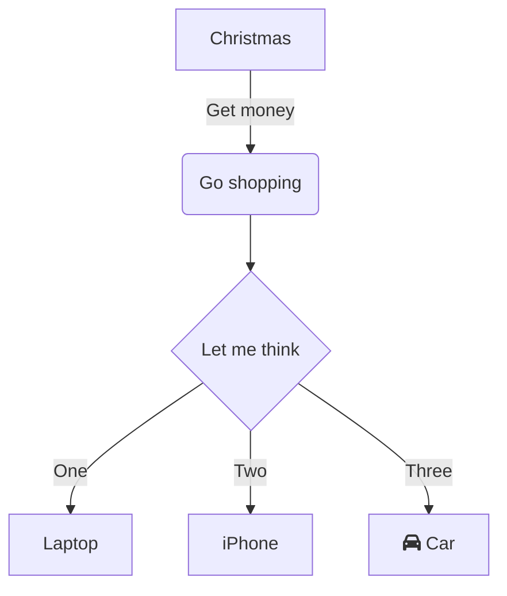

# meu projeto 3
## configuração
- Instalar Python
- Instalar VS Code
- Executar
``` python
Python script.py
```
## arquitetura


```mermaid
flowchart TD
    A[Christmas] -->|Get money| B(Go shopping)
    B --> C{Let me think}
    C -->|One| D[Laptop]
    C -->|Two| E[iPhone]
    C -->|Three| F[fa:fa-car Car]
```

